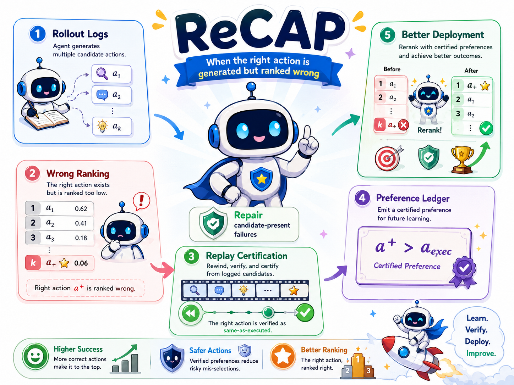
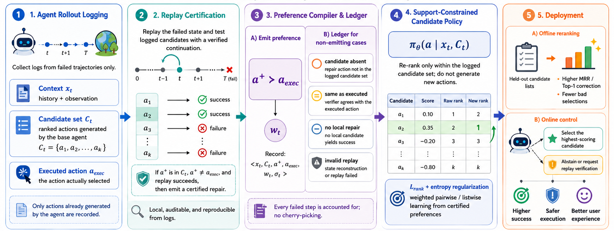
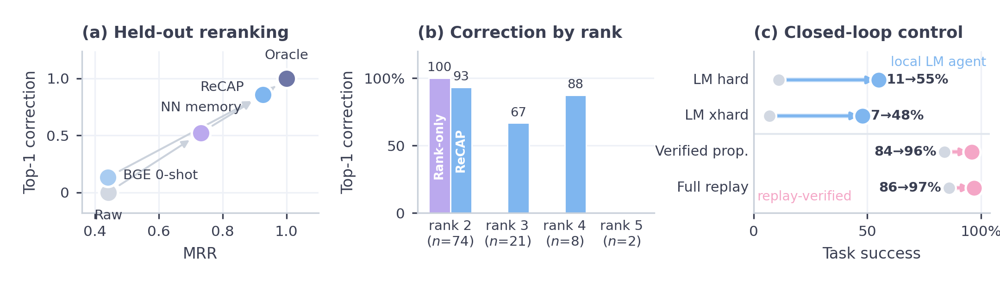

<div align="center">



# ReCAP: Replay-Certified Candidate-Level Preference Learning

**When an agent knows the right action but ranks it wrong.**

</div>

---

## What is ReCAP?

When an LLM agent fails a task, the repairing action is often *already in its own
candidate list* — just ranked below the action it executed. ReCAP isolates this
**candidate-ranking failure** and turns it into supervision: it replays each failed
step, certifies which logged candidate actually repairs it, and learns a policy
that reranks **only within the actions the agent already generated**.

This makes the learning signal *auditable* — every preference is backed by a
deterministic replay, and every failed step is accounted for in a ledger
(repairable, candidate-absent, same-as-executed, or no-local-repair), so the
denominator of "how much of failure is even addressable by reranking" stays
visible instead of being cherry-picked.

## The pipeline

<div align="center">

</div>

1. **Agent rollout logging** — collect failed trajectories with their top-*k*
   candidate set and the executed action. Only actions the agent already proposed
   are recorded.
2. **Replay certification** — rewind each failed step and test the logged
   candidates against a verified continuation. Local, reproducible, no
   cherry-picking.
3. **Preference compiler & ledger** — emit a certified preference
   *a⁺ ≻ a_exec* when a logged candidate repairs the step; record every
   non-emitting case in the ledger.
4. **Support-constrained candidate policy** — rank only within the logged
   candidate set, trained from the certified preferences (weighted pairwise +
   expected-reward + KL/rank-prior terms).
5. **Deployment** — use the policy both as an offline reranker and as an online
   verified-proposal controller.

## Key results

| Setting | Metric | Baseline | ReCAP |
|---|---|---|---|
| Held-out reranking (TextWorld xhard) | MRR | 0.44 | **0.93** |
| Held-out reranking | Top-1 correction | — | **0.86** |
| Local LM agent, TextWorld **hard** | Success | 0.11 | **0.55** |
| Local LM agent, TextWorld **xhard** | Success | 0.07 | **0.48** |
| Online verified-proposal controller | Success | 0.84 | **0.96** |
| Cross-env: ALFWorld | Held-out MRR | 0.26 | **0.51** |
| Cross-env: ScienceWorld | Held-out MRR | 0.17 | **0.59** |

<div align="center">

</div>

The decomposition is not a TextWorld artifact: candidate misranking is even more
common on ALFWorld, while ScienceWorld is generation-limited (most failures are
candidate-*absent*), which the ledger flags directly.

## Installation

```bash
git clone https://github.com/MarrytheToilet/ReCAP.git
cd ReCAP
pip install -e ".[test]"
# core runtime deps: torch, transformers, sentence-transformers, openai
# optional environments: pip install -e ".[textworld]"   # plus alfworld / scienceworld
```

## Quickstart

Verify the deterministic replay core:

```bash
pytest -q
```

Run the local LM-agent loop with no external API (mock LLM):

```bash
python -m recap.eval.eval_agent data/textworld_games/recap_seed11.z8 \
  --agent mock-llm --controller prior --fast-controller \
  --max-candidates 5 --max-steps 12
```

Compile certified preferences from a failed run, split, then train and evaluate a
candidate-ranking reranker:

```bash
# 1. compile replay-certified preferences + ledger from logged trajectories
python -m recap.eval.compile_recap_batch \
  --trajectories analysis/recap_xhard_pilot_trajectories.jsonl \
  --source policy-repair \
  --out-preferences analysis/recap_pilot_preferences.jsonl \
  --out-ledger analysis/recap_pilot_ledger.jsonl \
  --out-summary analysis/recap_pilot_compile_summary.json

# 2. leakage-checked train/valid/test splits (disjoint by seed or task)
python -m recap.eval.make_recap_splits \
  --preferences analysis/recap_pilot_preferences.jsonl \
  --split-by task_id --out-dir analysis/recap_pilot_splits

# 3. train + evaluate the support-constrained candidate policy
python -m recap.models.train_policy_reranker \
  --train analysis/recap_pilot_splits/train.jsonl \
  --out models/recap_policy_reranker.pt
python -m recap.models.eval_policy_reranker \
  --test analysis/recap_pilot_splits/test.jsonl \
  --model models/recap_policy_reranker.pt \
  --out analysis/recap_pilot_policy_eval.json
```

To run against an OpenAI-compatible API, copy `.env.example` to `.env` and set
`OPENAI_API_KEY`, `OPENAI_BASE_URL`, and `RECAP_LLM_MODEL`, then pass
`--agent openai`.

## Repository layout

```
recap/
  agents/        LLM, mock, learned-reranker, and preference agents
  controllers/   PriorController (heuristic) + replay-repair / verified-proposal controllers
  envs/          TextWorld, ALFWorld, ScienceWorld, toy adapters (deterministic replay)
  eval/          rollout logging, replay certification, preference compiler, evaluators
  models/        cross-encoder (BGE) and support-constrained policy rerankers
  data/          game generation and relation/preference dataset builders
  probe/ rewrite/ rl/   action-pair probes, normal-form rewriting, tabular-Q baselines
tests/           replay, decomposition, reranking, and agent-loop tests
assets/          figures
```

## Citation

If you use ReCAP, please cite the accompanying paper (see `paper/`).

```bibtex
@misc{recap,
  title  = {When Agents Know the Right Action but Rank It Wrong:
            Replay-Certified Candidate-Level Preference Learning},
  year   = {2026},
}
```
