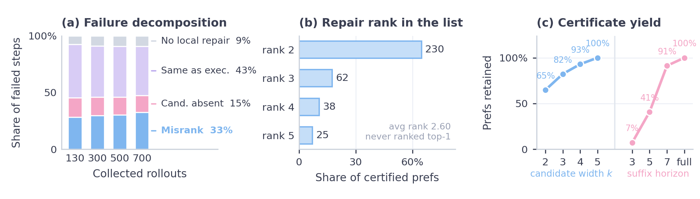

<div align="center">


# ReCAP: Replay-Certified Candidate-Level Preference Learning

**When an agent knows the right action but ranks it wrong.**

</div>

---

## TL;DR

When an LLM agent fails a task, the action that would have fixed it is often
**already in the agent's own candidate list — just ranked below the action it
executed**. ReCAP isolates this *candidate-ranking failure*, replays each failed
step to **certify** which logged candidate actually repairs it, and learns a
policy that reranks **only within the actions the agent already generated**.
Every preference is backed by a deterministic replay, and every failed step is
accounted for in a ledger — so the result is auditable, not cherry-picked.

## The story

Language agents act as sequential controllers: read a state, propose a ranked
list of candidate actions, execute the top one, inherit the next state. When such
an agent fails a long-horizon task, the convenient diagnosis is "it didn't know
the right action." That is often too coarse. Failure logs reveal a sharper
pattern: **the repairing action was already in the candidate list, just ranked
too low.**

This distinction is *operational*, because it splits failures into two repair
paths that need different fixes:

- **Candidate-absent** — the right action is not in the set at all. The
  bottleneck is generation/exploration; no reranker can help.
- **Candidate-misranked** — the right action is present but not selected. The
  agent already exposed the knowledge and failed at the *last* selection step.
  This is what ReCAP repairs.

ReCAP makes the second case learnable without judges, reward models, or
expert demonstrations. It rewinds each failed step in a resettable environment
and checks, by **replay**, whether any logged candidate leads to a verified
successful continuation. If one does, it becomes a certified preference
`a⁺ ≻ a_exec`. If none does, the step is filed in a **ledger**
(same-as-executed / no-local-repair / candidate-absent) so the *denominator* of
how much failure reranking can even address stays visible.

## How it works

<div align="center">

</div>

1. **Agent rollout logging** — collect failed trajectories with their top-*k*
   candidate set and executed action. Only actions the agent already proposed are
   recorded (the support).
2. **Replay certification** — rewind each failed step and test the logged
   candidates against a verified continuation. Local, deterministic, reproducible
   from logs, no cherry-picking.
3. **Preference compiler & ledger** — emit `a⁺ ≻ a_exec` when a logged candidate
   repairs the step; record every non-emitting case in the ledger.
4. **Support-constrained candidate policy** — rank only within the logged
   candidate set, trained from the certified preferences (weighted pairwise +
   expected-reward + KL/rank-prior terms; LoRA fine-tuning for the local agent).
5. **Deployment** — the same policy serves as an **offline reranker** and as an
   **online verified-proposal controller** (a proposal is committed only if
   branch replay proves a shorter successful suffix).

## Method in brief

A certified preference is a tuple `(a⁺ ≻ a_exec | s_t, C_t)`: at logged state
`s_t` with candidate set `C_t`, replay proved that some `a⁺ ∈ C_t` yields a
verified successful suffix where the executed action `a_exec` did not. ReCAP
trains a **support-constrained** policy `π_θ(a | C_t)` that scores *only* the
candidates in `C_t` — it never invents actions, it reorders the ones the agent
already produced. The training objective combines three terms:

- a **weighted pairwise** term over certified preferences (`a⁺` above `a_exec`),
- an **expected-reward** term from the replay outcomes, and
- a **KL / rank-prior** regularizer toward the base ordering,

so selection improves without drifting off the logged support. For the
closed-loop agent the same objective is applied as a KL-regularized LoRA update on
Gemma2-2B; at test time the policy scores the admissible pool and executes its top
action with no external reranker or API.

## Results

| Setting | Metric | Baseline | ReCAP |
|---|---|---|---|
| Held-out reranking, TextWorld xhard | MRR | 0.44 | **0.93** |
| Held-out reranking | Top-1 correction | 0.00 | **0.86** |
| Local Gemma2-2B agent, TextWorld **hard** | Success | 0.11 | **0.55** |
| Local Gemma2-2B agent, TextWorld **xhard** | Success | 0.07 | **0.48** |
| Online verified-proposal controller (API agent) | Success | 0.84 | **0.96** |
| Cross-env: ALFWorld | Held-out MRR | 0.26 | **0.51** |
| Cross-env: ScienceWorld | Held-out MRR | 0.17 | **0.59** |

<div align="center">

</div>

- **Offline.** A support-constrained policy moves held-out candidate-ranking MRR
  from 0.44 to 0.93 (0.86 top-1 correction) on 105 disjoint test preferences,
  beating BGE-ReCAP-SFT, nearest-neighbour memory, and embedding baselines.
- **Closed-loop.** Trained into a local Gemma2-2B agent that directly selects and
  executes, success rises 0.11→0.55 (hard) and 0.07→0.48 (xhard); the agent picks
  the gold action far more often and cuts structurally bad loop/no-op actions
  threefold (48 rescued / 4 harmed on hard, paired 95% CI `[+33,+55]` pts).
- **Online.** As a replay-verified controller on a stronger API agent, success
  goes 0.84→0.96 (12 rescued, 0 harmed) while shortening episodes — verifier-free
  gates do not move the needle, but replay verification does.
- **Generality.** The same pipeline transfers to ALFWorld (misranking is even
  *more* common there) and flags ScienceWorld as generation-limited (most
  failures are candidate-*absent*). Ablations and sensitivity checks attribute the
  gains to the certified preferences, not the loss form or candidate budget.

<div align="center">

</div>

## Environments

| Environment | Role | What the ledger reveals |
|---|---|---|
| TextWorld (hard / xhard) | primary | misranking is common **and** repairable |
| ALFWorld | transfer | misranking even more common, different action vocabulary |
| ScienceWorld | transfer | generation-limited: most failures are candidate-*absent* |

Every adapter exposes a deterministic reset and normalized commands — that is what
makes replay certification sound and reproducible.

## Scope and limitations

ReCAP repairs **candidate-present** failures. Candidate-absent steps need stronger
generation or search; same-as-executed and no-local-repair steps point to earlier
or longer-horizon causes. The ledger *counts* all of these, so the addressable
share of failure is explicit rather than hidden. The certificate assumes a
**replayable** environment (deterministic reset plus a verifier suffix — here,
normalized TextWorld-family commands); extending to web, embodied, or
manipulation agents requires environment-specific certificates such as repeated
branch sampling, partial-progress checks, state-equivalence predicates, or learned
suffix policies.

## Install

```bash
git clone https://github.com/MarrytheToilet/ReCAP.git
cd ReCAP
pip install -e ".[test]"
# core runtime deps: torch, transformers, sentence-transformers, openai
# optional environments: pip install -e ".[textworld]"   # plus alfworld / scienceworld
```

## Reproduce, step by step

**0. Verify the deterministic replay core (no GPU, no API):**

```bash
pytest -q
```

**1. Run the local agent loop with a mock LLM (no external API):**

```bash
python -m recap.eval.eval_agent data/textworld_games/recap_seed11.z8 \
  --agent mock-llm --controller prior --fast-controller \
  --max-candidates 5 --max-steps 12
```

**2. Reproduce the headline offline-reranking number** — from logged
trajectories to a held-out MRR, the core ReCAP loop:

```bash
# (a) compile replay-certified preferences + ledger
python -m recap.eval.compile_recap_batch \
  --trajectories analysis/recap_xhard_pilot_trajectories.jsonl \
  --source policy-repair \
  --out-preferences analysis/prefs.jsonl \
  --out-ledger analysis/ledger.jsonl \
  --out-summary analysis/compile_summary.json

# (b) leakage-checked, disjoint train/valid/test splits
python -m recap.eval.make_recap_splits \
  --preferences analysis/prefs.jsonl --split-by task_id \
  --out-dir analysis/splits

# (c) train the support-constrained candidate policy
python -m recap.models.train_policy_reranker \
  --train analysis/splits/train.jsonl --out models/recap_policy.pt

# (d) evaluate held-out ranking (reports MRR + top-1 correction)
python -m recap.models.eval_policy_reranker \
  --test analysis/splits/test.jsonl --model models/recap_policy.pt \
  --out analysis/policy_eval.json
```

**3. Use a real API agent.** Copy the template and fill in credentials, then pass
`--agent openai`:

```bash
cp .env.example .env     # set OPENAI_API_KEY, OPENAI_BASE_URL, RECAP_LLM_MODEL
python -m recap.eval.eval_agent data/textworld_games/recap_seed11.z8 \
  --agent openai --controller prior --fast-controller \
  --max-candidates 5 --max-steps 12
```

The cross-encoder reranker (`train_cross_encoder_reranker` / `eval_cross_encoder_reranker`)
and the closed-loop LoRA policy (`train_lm_candidate_policy`) follow the same
splits; see `paper/` for the full protocol and exact configurations.

## Repository layout

```
recap/
  agents/        LLM, mock, learned-reranker, and preference agents
  controllers/   PriorController (heuristic) + replay-repair / verified-proposal controllers
  envs/          TextWorld, ALFWorld, ScienceWorld, toy adapters (deterministic replay)
  eval/          rollout logging, replay certification, preference compiler, evaluators
  models/        cross-encoder (BGE) and support-constrained policy rerankers
  data/          game generation and relation/preference dataset builders
  probe/ rewrite/ rl/   action-pair probes, normal-form rewriting, tabular-Q baselines
tests/           replay, decomposition, reranking, and agent-loop tests
assets/          figures
paper/           manuscript, full experimental protocol, and exact configs
```

## Citation

```bibtex
@misc{recap2026,
  title  = {When Agents Know the Right Action but Rank It Wrong:
            Replay-Certified Candidate-Level Preference Learning},
  year   = {2026},
  note   = {https://github.com/MarrytheToilet/ReCAP},
}
```
